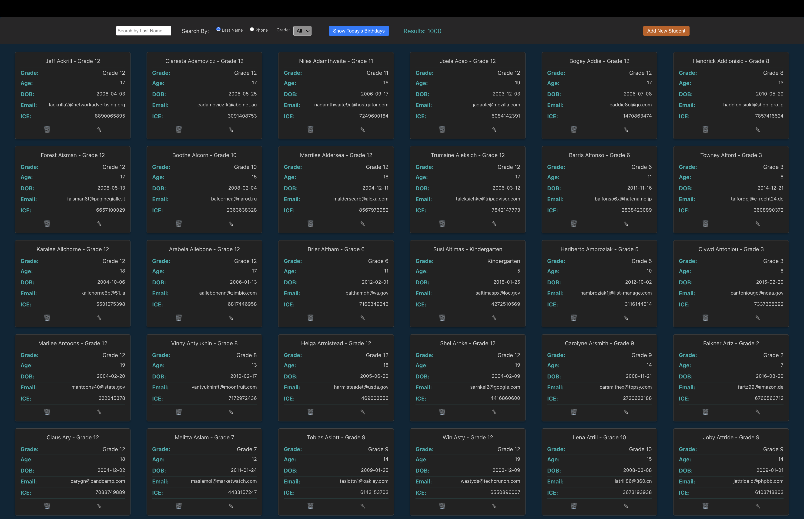

# Faculty Portal Application

### This is a lightweight frontend CRUD application built using the React framework that simulates a student database. CRUD functionality, however, was not my main focus. 
* My main focus was to keep the users interaction with the UI, specifically forms, to be "contained" within desired parameters.
## Key Features 
* Add, edit, view and delete students
* Search for students by name or phone number
* View students by grade 
* "Today's Birthays" button allows faculty members to quickly view a list of students who's birthday it is for those classic morning announcements! 
* Red "X" appears on all text inputs when insufficiently populated, keeping the user informed of expectations
## Simple Instructions to Try For Yourself
1. Near the top of this window, click on the green "Code" button, make sure "SSH" is selected and copy the provided SSH key.
2. Open your terminal and navigate to the directory into which you want to pull this application.
3. In the command line, enter "git clone [paste SSH key}".
4. The application is now on your machine! Now lets get it up and running.
5. Navigate into the "facultyPortal" directory.
6. Navigate into the "api" directory.
7. Enter "json-server database.json -p 8088 -w" and press enter.
8. In a new terminal tab, navigate into the "facultyPortal" directory.
9. Navigate into "client".
10. Navigate into "hcbb-take-home-exam-bjh".
11. Enter "npm install scripts".
12. Enter "npm start".
13. Enjoy! 
